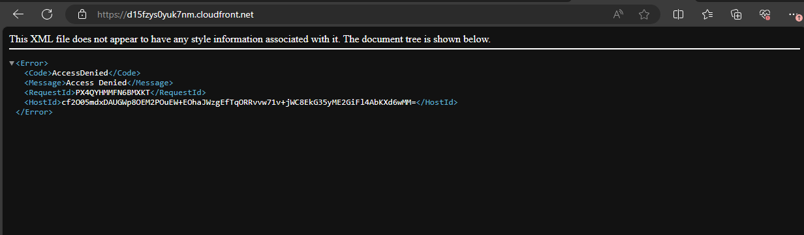

# AltSchool Cloud Track Semester III; First Assignment

## Objective
Create a static website and host it on AWS S3 bucket using CloudFront as CDN.

The bucket should be private but with policy set to allow public read.


## SOLUTION

### Pre-requistes;
1. AWS Account
2. Static Website

With an already existing AWS account and a static website secured and saved in a folder, the stage is set to execute the task to achieve the set objective using the following steps.

### Steps...

#### Step 1; Creating S3 Bucket

After a successful login into my AWS console, I navigated the menus as follows...
```
Services > Storage > S3 > Create bucket
```
This opened the bucket creation page where I selected the following options..
* AWS Region; left as my default region (Europe-eu-norht-1; Stockholm)
* Bucket Type; General purpose
* Bucket name; `honest-web-aws` (could be anything that suits my whim)
* Object ownership; ACLs disabled (the recommended choice) to preserve the privacy of the bucket
* Block Public Access settings for this bucket; Block all public access (default choice); again to preserve the bucket privacy and adhere to the instruction to make the bucket private.
* Bucket versioning; Disable (left at the default choice). Since the website is static and stateless, versioning isn't required.
* Tag; first-web; static (key/value pair), for reference
* Encryption; left at defaults
After these, clicked on Create button to create.
The screenshot below shows the created bucket.


#### Step 2; Uploading Website Files to Bucket

With the bucket created all we have is an empty bucket. So, it now needs to have objects or the files we intend to have it serve to the web following the actions below.
* Clicking on the bucket name to open it, opens a window for bucket configurations one of which is upload button. 
* Clicking on upload to open an upload page from where folder or file upload can be selected to either upload files one by one or folder.
* Used the Add folder button to add all contents in the website project folder to the stafe for upload, then clicked on the Upload button to initiate upload. The screenshot below shows the result of folder upload.

* After this, I moved the conten of the folder one step up have them on the bucket root directory.
This concludes the content addition to the bucket and the bucket root directory looks as seen in the screehshot below.


#### Step 3; Creating a Disribution List in ClouFront
CloudFront is a content delivery network (CDN) web service by AWS that speeds up the distribution of web contents to users through worldwide network of data centers called edge locations. When a request is made, of your web content, it's served from the data center nearest to the request because CloudFront has cachaed the web content in that nearest server, hence faster response.

* Launched CloudFront using the following navigation... 
    ```
    Services > Networking & Content Delivery > CloudFront > Create distribution
    ```

    This launches the distributtion creation page with configuration options as seen in the screenshot below...


    

* I created my website distribution using the following option on the creation form...

    - Origin domain; this should be the bucket endpoint. Since we are serving a website in the bucket, using an endpoint URL is required.
    - Origin path; left blank (it's optional, so didn't bother)
    - Origin Name; left it to be same as the domain above (it was automatically suggested so, I left it as that, though any unique name would have sufficed)
    - Origin access; Origin cccess control settings is selected. And this is vital to create a bucket policy that would grant public read access to the bucket since the bucket was made private. without the bucket policy edit, the website wouldn't be accessible as seen in this screenshot 

    - Origin Access Control; I clicked on 'Create new OAC' and used the S3 endpoint URL as the AOC name as automatically suggested (any name would have sufficed). The rest of the field were left as default, then clicked Create. Seen screenshot below. The access policy this will create will be available at the end of this distribution creation. More on this later.
    

    - Web Application Firewall (WAF); I played with the two options and eventually chose not to enable protection. It's a paid service and not necessary for this test project.
    - Default root object; index.html. This sets the landing page when the URL or domain to provided by CloudFront is visited. It's optional because it could be omitted since the endpoint URL is used for the domain origin and I am not using any other file other than index.html as landing page.
    - The rest of the field are left at default settings.
    - Create Distribution is clicked to finalize the process, which springs up the page seen in below screenshot. 
    
    - As seen in the above image of the distribute status page, policy statement was created as discussed above with a button to copy it. That procedure will be discussed in the next step.
    - Also the distributed is identified with a 14 digits alphanumeric (E1SBDWDV3RF8P2). Then, first on the general tab is the distribution domain name (https://d10qwyhovw3b3k.cloudfront.net) which is auto-generated by CloudFront since I didn't create a custom domain to be used. This domain when visted yields the same result as the S3 bucket endpoint URL as seen below. Which isn't suprise because our bucket remains private and can't be viewed by the public until made public or allowed public read. That takes us to the next step in the project. 
    

#### Step 4; Editing Bucket Policy in Our S3 Bucket
Now, on the S3 bucket, permissions have to be granted to CloudFront to allow access to the content therein which in this case is the static website uploaded. This will made possible by using the policy statement generated at the end of the CloudFront disttibution creation which was copied and used to update the bucket policy as outlined below...
   
* Naviagated back the target S3 that was previously created and identified by the given name; "honest-web-aws" like this...
    ```
    Services > Storage > S3 > honest-web-aws 
    ```

* Click on the permissions tab and select Edit under Bucket policy


* Paste the copied policy statement in the provided textarea then click Save changes to save and exit. See the screenshot.. 
.

And that is all the settings and configurattions done. Next is to head to our browser to confirm that the webpage is served as expected.

#### Step 5; Verifying Result.
With the permission done to grant access to CloudFront to publish the web content in the bucket, I went back to the browser to refresh the domain name assigned by CloudFront which had earlier given us access denied page at first try. And..... BOOM!!! 

This time it successfully gave access to the webpage, which is the desired out come. This can be verified on the following domain.
https://d10qwyhovw3b3k.cloudfront.net/

And the screenshot evidence is attached below..
.

### CONCLUSION
With this little exercises I have fulfilled the set objective of the semester assignment and demostrated the use of AWS S3 bucket to host a static website with AWS CloudFront as the CDN of choice witn permissions set to allow public read of a private bucket.

Thanks for taking the time to read.
